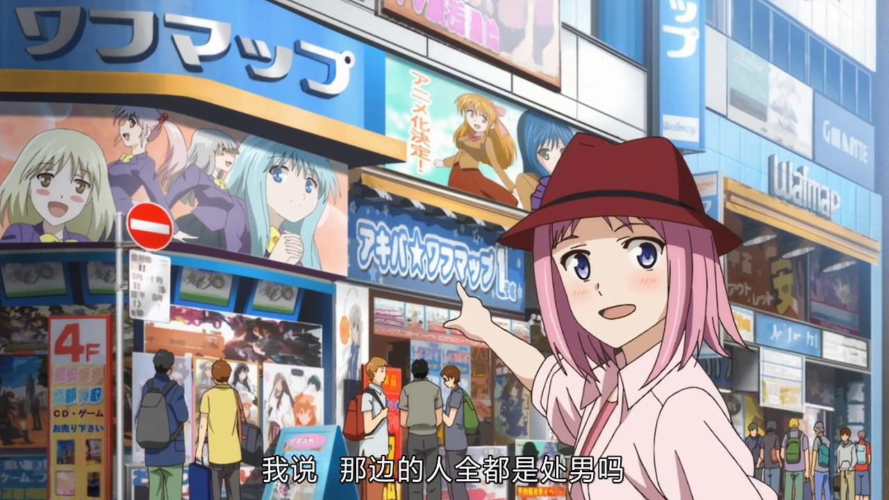

# AkibaSakusen

## 1/10

> NH962 15:35-19:55

- 晚上 抵達羽田國際機場
- 到**大久保**住宿

## 1/11

> 可能先要換 JR Pass，主要交通方式：JR Pass + 私鉄。

- 清晨 前往**筑地市場**品嚐美食（壽司）：早晨六點，「大和」是吃不到了？
- 上午 **東京國立博物館**
- 下午 **淺草寺**
- 下午、晚上 **秋葉原**：宅物和電器
- 回**新宿**

## 1/12

> 主要交通方式：JRPass + 私鉄

- 清晨 聖地巡禮：**新宿御苑**（言葉之庭）
- 清晨 聖地巡禮：**新宿警察局後路口** + **須賀神社**（你的名字）
- 上午 **吉祥寺** 或者 **明治神宫**（代代木，原宿）
- 下午 **銀座**逛街
- 晚上 遠眺**東京塔**夜景（或者直接去）
- 回新宿

## 1/13 

> 箱根溫泉之旅。主要交通方式：JR Pass + 私鉄

- 上午 **新宿**->**箱根**
	- 到**小田原** 湘南新宿ライン快速 7:55-9:47
	- はこね９，8:53-10:36，新宿->箱根湯本
- 下午 入住，溫泉
- 晚上 休息

## 1/14 

> 主要交通方式：JR Pass + 使用 500 日元一天的公交通票

- 早晨 **箱根**->**京都**
	- 箱根湯本，私鉄到小田原，轉ひかり５０３，7:34-10:11
- 入住（安利就住京都站邊上）
- 下午**金閣寺**
- 晚上**花間小路**、**市中心**

## 1/15

- 上午 **京都御所** **清明神社**

## 1/16

- 中午 **京都**->**東京**
- 入住
- 晚上 IMAX 你的名字

## 1/17

> NH955 18:25-21:40

- 下午 兩點左右出發啓程去成田機場

